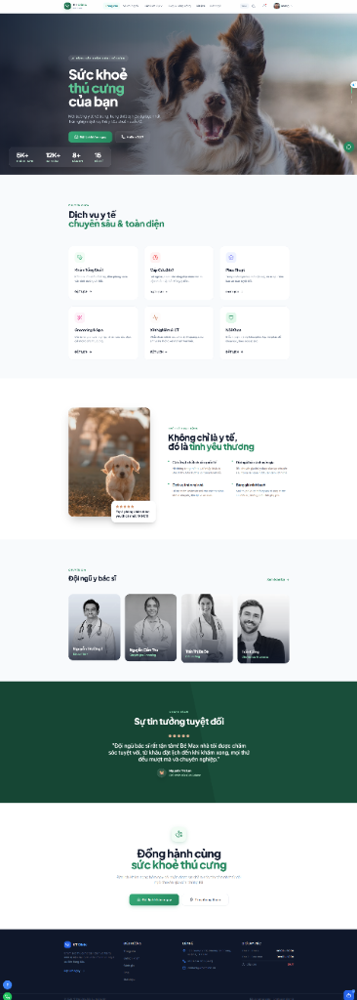
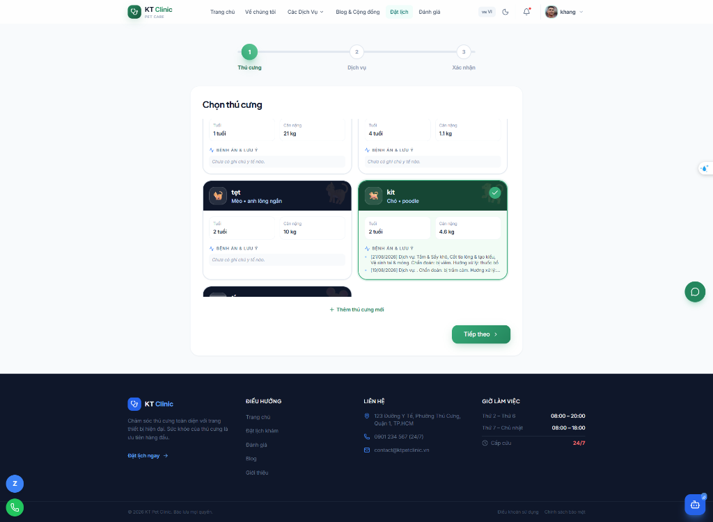
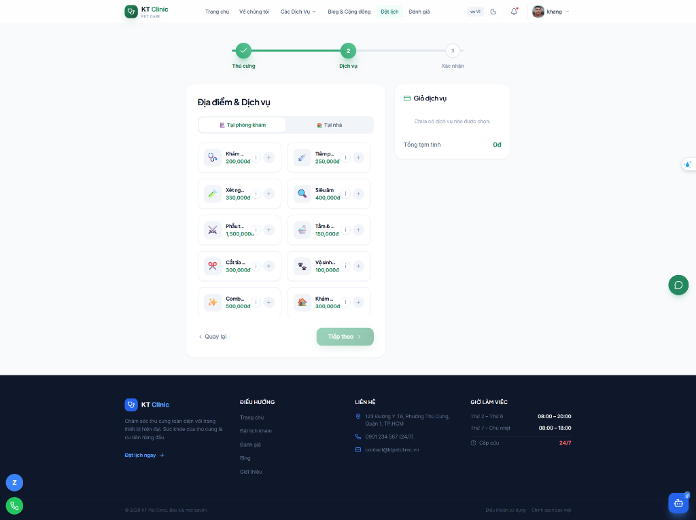
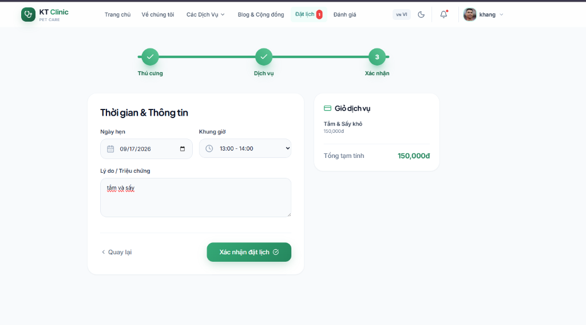
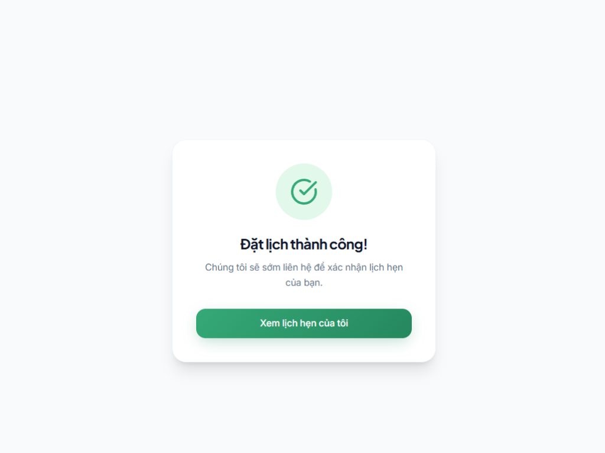

<div align="center">

# 🐾 KT Pet Clinic

### Hệ thống Quản lý Phòng khám Thú y Toàn diện

[](https://react.dev)
[](https://nodejs.org)
[](https://mongodb.com)
[](https://socket.io)
[](https://tailwindcss.com)
[](https://vnpay.vn)

**Một ứng dụng web full-stack hiện đại giúp phòng khám thú y số hóa toàn bộ quy trình vận hành** — từ đặt lịch hẹn, quản lý hồ sơ thú cưng, thanh toán trực tuyến đến giao tiếp thời gian thực giữa Admin và Khách hàng.

</div>

---

## ✨ Tính năng nổi bật

### 👤 Phân hệ Khách hàng

| Tính năng | Mô tả |
|-----------|-------|
| 🔐 Xác thực đa phương thức | Đăng nhập Email/Password + Google OAuth 2.0 |
| 📧 Quên mật khẩu OTP | OTP 6 số gửi qua Gmail SMTP, hiệu lực 10 phút |
| 🐾 Quản lý Thú cưng | Sổ tiêm phòng điện tử, Cập nhật lịch sử bệnh án, Thư viện ảnh cá nhân |
| 📅 Đặt lịch hẹn (Wizard) | 5 bước trực quan: Thú cưng → Dịch vụ → Bác sĩ/Ngày giờ → Địa điểm → Thanh toán |
| 💳 Thanh toán đa hình thức | VNPay (HMAC-SHA512) + VietQR (tự động đối soát) + Tiền mặt |
| 📄 Xuất PDF Phiếu Khám | Trích xuất hóa đơn và chi tiết lịch hẹn sang file PDF chuyên nghiệp |
| ⭐ Đánh giá dịch vụ | Hệ thống rating 5 sao và bình luận sau khi hoàn thành dịch vụ |
| 🔔 Thông báo & Nhắc lịch | Socket.io push notification + Auto Email Reminder nhắc lịch trước 1 ngày |
| 💬 Live Chat & AI Chatbot | Chat với Admin + Trợ lý AI (Gemini) tư vấn thú y |
| 🗺️ Bản đồ & Định vị | Tích hợp bản đồ Leaflet OpenStreetMap chỉ đường tới phòng khám |

### 🛡️ Phân hệ Quản trị (Admin Dashboard)

| Tính năng | Mô tả |
|-----------|-------|
| 📊 Dashboard Tổng quan | KPI Cards + Biểu đồ doanh thu (LineChart, BarChart) bằng Recharts |
| 📅 Quản lý Lịch hẹn | Duyệt/Hủy lịch, lọc theo trạng thái, gửi thông báo tự động |
| 💰 Quản lý Tài chính | Đối soát VNPay/VietQR, thống kê doanh thu theo tháng/phương thức |
| 👥 Quản lý Khách hàng | Xem hồ sơ, lịch sử khám, danh sách thú cưng của từng khách |
| 👨‍⚕️ Bảng phân công | Quản lý lịch làm việc bác sĩ, chuyên khoa |
| 📝 Quản lý Blog | Đăng bài viết kiến thức chăm sóc thú cưng |
| 💬 Admin Chat | Hộp thư 2 cột, badge đỏ tin chưa đọc, chat thời gian thực |

---

## 🏗️ Kiến trúc hệ thống

```
┌─────────────────────────────────────────────────────────┐
│                   CLIENT LAYER                          │
│   ReactJS 19 + Vite + Tailwind CSS + Framer Motion     │
│        Axios (REST) │ Socket.io Client (WebSocket)      │
└─────────────────────┬───────────────────────────────────┘
                      │ HTTP / WebSocket
┌─────────────────────▼───────────────────────────────────┐
│                APPLICATION LAYER                        │
│          Node.js + Express v5 (RESTful API)             │
│    JWT Auth │ RBAC Middleware │ Socket.io Server        │
└──────────┬───────────────────┬──────────────────────────┘
           │                   │
┌──────────▼────────┐  ┌───────▼─────────────────────────┐
│   DATA LAYER      │  │       EXTERNAL SERVICES          │
│  MongoDB Atlas    │  │  VNPay Sandbox (HMAC-SHA512)     │
│  Mongoose ODM     │  │  VietQR / Casso (Webhook)        │
│  10 Collections   │  │  Google OAuth 2.0                │
│  Compound Index   │  │  Google Gemini AI                │
└───────────────────┘  │  Gmail SMTP (Nodemailer)         │
                       └──────────────────────────────────┘
```

---

## 🚀 Cài đặt và Chạy local

### Yêu cầu hệ thống
- Node.js >= 18.x
- MongoDB Atlas account (miễn phí)
- Git

### Clone & Cài đặt

```bash
# 1. Clone repository
git clone https://github.com/<your-username>/kt-clinic.git
cd kt-clinic

# 2. Cài đặt Backend
cd backend
cp .env.example .env
# Mở file .env và điền các giá trị thật
npm install

# 3. Cài đặt Frontend
cd ../frontend
npm install
```

### Chạy Development

```bash
# Terminal 1 — Backend (http://localhost:5000)
cd backend && npm run dev

# Terminal 2 — Frontend (http://localhost:5173)
cd frontend && npm run dev
```

### Tài khoản Demo

| Role | Email | Mật khẩu |
|------|-------|----------|
| 👑 Admin | `admin` | Xem .env → ADMIN_PASSWORD |
| 👤 Customer | Đăng ký mới | Bất kỳ |

---

## 🔑 Cấu hình môi trường (.env)

```bash
# Tham khảo backend/.env.example để biết đầy đủ các biến cần cấu hình

MONGODB_URI=mongodb+srv://...
JWT_SECRET=<chuỗi random 64 ký tự>
GOOGLE_CLIENT_ID=<Google OAuth Client ID>
GEMINI_API_KEY=<Google AI Studio API Key>
VNP_TMN_CODE=<VNPay merchant code>
VNP_HASH_SECRET=<VNPay hash secret>
CASSO_SECURE_TOKEN=<Casso webhook token>
GMAIL_USER=your@gmail.com
GMAIL_APP_PASSWORD=<16 ký tự App Password>
```

---

## 📡 API Endpoints (30 endpoints)

<details>
<summary><b>🔐 Authentication</b></summary>

| Method | Endpoint | Mô tả |
|--------|----------|-------|
| POST | `/api/auth/register` | Đăng ký tài khoản |
| POST | `/api/auth/login` | Đăng nhập, nhận JWT |
| POST | `/api/auth/google` | Đăng nhập Google OAuth |
| POST | `/api/auth/forgot-password` | Gửi OTP qua Email |
| POST | `/api/auth/reset-password` | Đặt lại mật khẩu bằng OTP |

</details>

<details>
<summary><b>📅 Appointments</b></summary>

| Method | Endpoint | Auth | Mô tả |
|--------|----------|------|-------|
| POST | `/api/appointments` | User | Tạo lịch hẹn mới |
| GET | `/api/appointments/my-appointments` | User | Lịch hẹn của tôi |
| GET | `/api/appointments` | Admin | Tất cả lịch hẹn |
| PUT | `/api/appointments/:id/status` | Admin | Duyệt/Hủy lịch |
| PATCH | `/api/appointments/:id/cancel` | User | Hủy lịch (có lý do) |
| GET | `/api/appointments/revenue` | Admin | Thống kê doanh thu |

</details>

<details>
<summary><b>💳 Payments</b></summary>

| Method | Endpoint | Auth | Mô tả |
|--------|----------|------|-------|
| POST | `/api/payments/vnpay/create-url` | User | Tạo URL VNPay |
| GET | `/api/payments/vnpay/verify-return` | — | Callback VNPay |
| GET | `/api/payments/qr/:id` | User | Tạo mã QR VietQR |
| POST | `/api/payments/webhook` | Token* | Webhook Casso |
| GET | `/api/payments/transactions` | Admin | Lịch sử giao dịch |

*Bảo vệ bằng `CASSO_SECURE_TOKEN` trong request header

</details>

<details>
<summary><b>💬 Chat & Notifications</b></summary>

| Method | Endpoint | Auth | Mô tả |
|--------|----------|------|-------|
| GET | `/api/messages/:userId` | User/Admin | Lịch sử chat |
| POST | `/api/messages` | User/Admin | Gửi tin nhắn |
| GET | `/api/messages/conversations` | Admin | Danh sách cuộc chat |
| GET | `/api/notifications` | User | Danh sách thông báo |
| PUT | `/api/notifications/read-all` | User | Đánh dấu đã đọc |

</details>

---

## ⚡ Socket.io Events (Real-time)

| Sự kiện | Hướng | Mô tả |
|---------|-------|-------|
| `join_room` | Client → Server | User join phòng cá nhân |
| `join_admin` | Client → Server | Admin join admin_room |
| `send_message` | Client → Server | Gửi tin nhắn chat |
| `receive_message` | Server → Client | Nhận tin nhắn mới |
| `new_appointment` | Server → Admin | Có lịch hẹn mới |
| `new_notification` | Server → User | Thông báo cá nhân |

---

## 🛡️ Bảo mật

- **JWT Authentication** — Bearer Token, bcrypt salt 10 rounds
- **RBAC Middleware** — `protect` (user) + `admin` (quản trị viên)
- **IDOR Protection** — Kiểm tra quyền sở hữu Pet trước khi đặt lịch
- **VNPay Security** — Ký và xác thực HMAC-SHA512 cho mọi giao dịch
- **Webhook Security** — Xác thực `CASSO_SECURE_TOKEN` từ Casso
- **Double-booking Prevention** — Unique compound index `{date, timeSlot, vetId}`
- **OTP Security** — OTP không bao giờ trả về HTTP response, chỉ gửi qua email
- **Mass Assignment Protection** — Whitelist fields cho tất cả update endpoints

---

## 🧰 Tech Stack

### Backend
```
Express v5 · Mongoose v9 · Socket.io v4 · JWT · bcryptjs
Nodemailer · Google Auth Library · Gemini AI SDK · dayjs
```

### Frontend
```
React 19 · Vite · Tailwind CSS v3 · Framer Motion v12
Axios · Socket.io Client · React Router v7 · Lucide React
```

---

## 📁 Cấu trúc thư mục

```
kt-clinic/
├── backend/
│   ├── controllers/     # 12 controllers (business logic)
│   ├── models/          # 10 Mongoose schemas
│   ├── routes/          # 12 Express routers
│   ├── middlewares/     # JWT Auth + RBAC
│   ├── utils/           # Helper functions
│   ├── server.js        # Entry point + Socket.io
│   └── .env.example     # Cấu hình mẫu
│
├── frontend/src/
│   ├── components/      # Reusable UI components
│   ├── contexts/        # React Context (Auth, Alert)
│   ├── pages/           # Pages (Home, Booking, MyAppointments...)
│   │   └── admin/       # Admin Dashboard pages
│   └── main.jsx
│
└── README.md
```

---

## 🗺️ Roadmap

- [x] Xác thực Google OAuth 2.0
- [x] Đặt lịch hẹn Wizard 5 bước
- [x] Thanh toán VNPay HMAC-SHA512
- [x] Thanh toán VietQR tự động đối soát
- [x] Live Chat thời gian thực (Socket.io)
- [x] AI Chatbot (Gemini)
- [x] Admin Dashboard + Recharts
- [x] Tích hợp Bản đồ chỉ đường (Leaflet)
- [x] Nhắc lịch tự động qua Email (Cronjob)
- [x] Xuất PDF Phiếu Khám
- [x] Sổ tiêm phòng điện tử
- [x] Hệ thống Đánh giá 5 sao
- [ ] Ứng dụng Mobile (React Native)

---

## 📸 Giao diện chức năng (Screenshots)

### 1. Trang chủ & Đặt lịch hẹn

<br>


<br>


<br>


<br>


<br>

### 2. Quản lý Thú cưng & Sổ tiêm phòng
<!-- Chèn ảnh Quản lý thú cưng tại đây:  -->
<br>

### 3. Tích hợp Thanh toán (VNPay / VietQR)
<!-- Chèn ảnh Màn hình thanh toán tại đây:  -->
<br>

### 4. Admin Dashboard
<!-- Chèn ảnh Dashboard tại đây:  -->
<br>

---

## ⚙️ Luồng hoạt động chi tiết (Backend Workflows)

### 1. Luồng Đặt lịch hẹn (Booking Flow)
1. **Khách hàng** chọn thú cưng, dịch vụ, bác sĩ và thời gian.
2. `appointmentController` kiểm tra tính hợp lệ và **Double-booking** (trùng lịch bác sĩ) thông qua compound index `{date, timeSlot, vetId}`.
3. Lịch hẹn được tạo với trạng thái `pending`.
4. **Socket.io** bắn event `new_appointment` đến phòng `admin_room` để Admin nhận thông báo realtime.

### 2. Luồng Thanh toán VNPay
1. `paymentController` nhận thông tin hóa đơn và tạo chuỗi URL ký bằng **HMAC-SHA512** dựa trên `VNP_HASH_SECRET`.
2. Khách hàng thanh toán trên cổng VNPay.
3. VNPay redirect về endpoint `/api/payments/vnpay/verify-return`.
4. Backend kiểm tra chữ ký hợp lệ. Nếu thành công, cập nhật trạng thái hóa đơn thành `Paid` và trạng thái lịch hẹn thành `confirmed`.
5. Tạo bản ghi `PaymentTransaction` lưu lịch sử giao dịch.

### 3. Luồng Thanh toán VietQR (Casso Webhook)
1. Casso nhận biến động số dư từ ngân hàng và gọi **POST Webhook** về `/api/payments/webhook`.
2. Backend kiểm tra `CASSO_SECURE_TOKEN` trong header để xác thực request.
3. Trích xuất mã đơn hàng (Mã giao dịch) từ chuỗi mô tả chuyển khoản (ví dụ: `KTPET <MãLịchHẹn>`).
4. Tìm và cập nhật trạng thái thanh toán của lịch hẹn tương ứng thành `Paid`.
5. Bắn event Socket.io cho Admin và User cập nhật trạng thái đơn hàng ngay lập tức.

### 4. Luồng Xác thực (Authentication)
1. Đăng ký tài khoản: Mật khẩu được băm (hash) bằng `bcryptjs` với salt 10 rounds.
2. Đăng nhập: Trả về **JWT Token** có thời hạn (ví dụ: 7 ngày). API được bảo vệ bởi middleware `protect` (kiểm tra token) và `admin` (kiểm tra Role).
3. Đăng nhập Google: Frontend lấy Google Credential gửi về backend. Backend dùng `google-auth-library` verify token, nếu email chưa tồn tại thì tạo user mới, ngược lại trả về JWT.

---

## 👨‍💻 Tác giả

**Triệu Duy Khang** — Đồ án Chuyên ngành Kỹ thuật Phần mềm

[](https://github.com/your-username)

---

<div align="center">
  <sub>⭐ Nếu dự án hữu ích, hãy cho một Star nhé! ⭐</sub>
</div>
